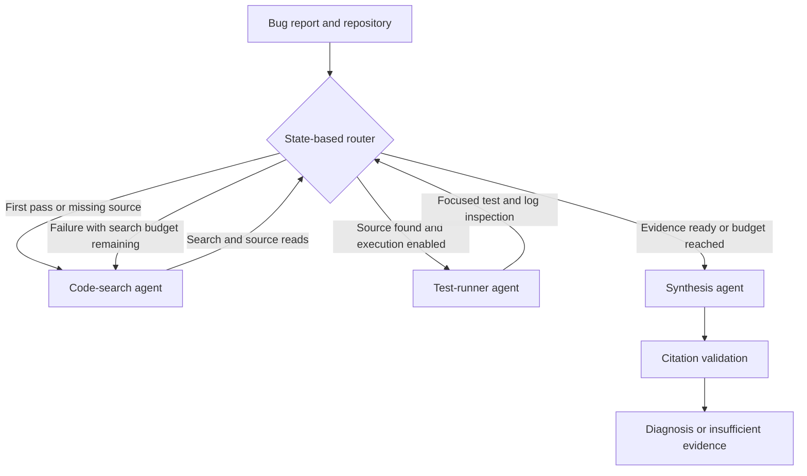

# Agentic Code-Search & Debugging Assistant

[](https://github.com/YeDonS/agentic-code-search/actions/workflows/ci.yml)
[English](README.md) · [简体中文](README.zh-CN.md) · [Interview walkthrough](docs/INTERVIEW.md)

An evidence-first developer assistant built with **LangChain, LangGraph, FastAPI, and Docker**.
Three specialist agents locate code, reproduce failures, and synthesize a diagnosis with
registered source citations. Patches are proposed without changing the repository.

## Implementation and evidence

| Component | Status |
|---|---|
| Search / test / synthesis agents and conditional routing | Implemented and covered by offline integration tests |
| Search, source reads, pytest execution, log inspection | Real tools with budgets and structured events |
| FastAPI, bearer authentication, OpenAPI docs | Real-model HTTP check passed: 401 without token, 200 with token |
| Docker service, restricted runner, Compose | Build and execution checks passed in GitHub Actions |
| 100 historical issues across 12 repositories | Pinned, reproducible SWE-bench Lite subset |
| Retrieval baseline on all 100 pre-fix snapshots | **100 completed; Hit@1 40%; Hit@5 71%; MRR@5 0.5202** |
| Real LLM run on all 100 issues | **90 cited diagnoses, 10 abstentions; file Hit@1 87%, Hit@5 88%** |
| Automated root-cause comparison | **87 correct, 1 partial, 2 incorrect, 10 unscorable**; human accuracy remains unmeasured |
| Generated-patch resolution | **48/100 resolved** in official SWE-bench tests; 23 failed, 27 empty, 2 timed out |

Baseline numbers measure **file localization against maintainer patches**, not bug-fix accuracy.
The real run uses `gpt-6.1-sol` through a locally authenticated Codex CLI, with a frozen
configuration and source fingerprint. Automated causal comparison is a labeled LLM judgment
with possible same-model bias. Functional resolution comes from the official SWE-bench harness.
The scripted demo is synthetic and excluded from the 100 historical tasks.
[Results and traces](reports/README.md) · [Reproduce real-model evaluation](docs/MODEL_EVALUATION.md).

## Quick start

Requirements: Python 3.11+, [uv](https://docs.astral.sh/uv/getting-started/installation/), Git.
The demo needs no model credentials or Docker.

```bash
git clone https://github.com/YeDonS/agentic-code-search.git
cd agentic-code-search
uv sync --locked --all-extras
uv run code-assistant demo
```

The demo investigates `calculate_total(100, discount=0)`, which incorrectly returns `90`.
It searches source, reads the function, runs actual tests (**1 failed, 2 passed**), reads the
failure log, refines the search, and returns a cited diagnosis and unified diff.
`mode=demo` is a scripted LangChain fixture, **not an LLM**; it accepts only this exact scenario.
A regression test applies the suggestion to a temporary copy and confirms **3 passed**.
The assistant itself runs baseline tests only, so its response retains `patch_verified=false`.

## Routing and tools



The supervisor uses deterministic rules. Models choose tool calls within each role. The three
agents have separate prompts, tool lists, and contexts, can share one model, and run sequentially.

| Agent | Tools |
|---|---|
| Code-search | `search_repository`, `read_file` |
| Test-runner | `read_file`, `run_tests`, `inspect_logs` |
| Synthesis | No execution tools; validated JSON diagnosis |

Affected files must occur in registered source-read citations. This verifies provenance, not
semantic correctness. Missing evidence or model abstention returns `insufficient_evidence`.
Search passes, model turns, tool calls, reads, test duration, and output size are capped.
[Architecture and limitations](docs/ARCHITECTURE.md).

## Real model and repository

You can use a local [Codex CLI login](https://learn.chatgpt.com/docs/non-interactive-mode)
instead of configuring a separate provider API key (tested with CLI 0.162.0-alpha.2):

```bash
codex login
export ASSISTANT_MODEL=codex-cli:gpt-6.1-sol  # select a model available to your account
export ASSISTANT_CODEX_REASONING_EFFORT=medium
export ASSISTANT_CODEX_TRANSPORT=https       # optional, useful on this evaluation network
uv run code-assistant doctor
uv run code-assistant debug /path/to/repository "Observed bug and expected behavior"
```

This consumes your Codex account allowance. The adapter uses an empty temporary directory,
disables built-in execution/search/connectors, and exchanges application tool calls through
structured JSON. Only the application's allowlisted tools see the repository. Authentication
stays with the CLI; never copy its login files into public CI or Docker images.

Alternatively, use a provider API key:

```bash
cp .env.example .env
# Edit ASSISTANT_MODE=model, ASSISTANT_MODEL=provider:model-id,
# and ANTHROPIC_API_KEY or OPENAI_API_KEY in .env.
uv run code-assistant debug /path/to/repository "Observed bug and expected behavior"
```

`debug` always uses model mode. Choose a model available to your account that supports tools.
The model name in `.env.example` is configurable. Keys load from environment variables or `.env`.
Source excerpts are sent to the configured provider. Test execution defaults to disabled;
opt in with `--executor local` only for trusted code, or use the host's Docker runner:

```bash
docker build --target test-runner -t code-assistant-test:local .
uv run code-assistant debug /path/to/repository "Bug description" --executor docker
```

The generic runner includes pytest, not arbitrary project dependencies. Build a suitable image
and set `ASSISTANT_TEST_IMAGE` when needed. Historical patch evaluation uses official SWE-bench images.

## FastAPI and Docker

```bash
# Explicit local execution for the trusted bundled fixture:
ASSISTANT_TEST_EXECUTOR=local uv run code-assistant serve
curl --noproxy 127.0.0.1 http://127.0.0.1:8000/v1/debug \
  -H 'Content-Type: application/json' \
  -d '{"repository":"checkout","issue":"Passing discount=0 to calculate_total(100, discount=0) returns 90 instead of 100."}'
```

Set `ASSISTANT_MODE=model` when serving with the real-model configuration above.
The [authenticated real-model HTTP check](reports/real-model-api/validation.json)
completed search → test → search → synthesis on the trusted synthetic fixture.

Open [interactive API docs](http://127.0.0.1:8000/docs). For other repositories, configure
`ASSISTANT_WORKSPACE_ROOT` and pass a relative directory. Configure `ASSISTANT_API_TOKEN` and
send `Authorization: Bearer <token>` before exposing beyond loopback. No wildcard CORS or
arbitrary shell-command endpoint is provided. At most two API runs execute concurrently.

```bash
docker compose up --build
docker compose run --rm assistant code-assistant demo
```

Compose binds loopback, runs as non-root with a read-only filesystem, persists artifacts in
a named volume, and disables API test execution by default. No Docker socket is mounted.
For real repositories, add a read-only bind mount and configure its container workspace path.

## Historical benchmark

```bash
uv run code-assistant benchmark build  # optional: rebuild the checked-in, pinned task set
uv run code-assistant benchmark run runs/my-retrieval-100 --mode retrieval
uv run code-assistant logs runs/my-retrieval-100
# Requires provider credentials; pilot before scaling:
uv run code-assistant benchmark run runs/model-pilot --mode model --limit 3
uv run code-assistant benchmark run runs/model-100 --mode model --workers 6
# Resume only the exact same source/environment/model/task configuration:
uv run code-assistant benchmark run runs/model-100 --mode model --workers 6 --resume
uv run code-assistant benchmark export runs/model-100/predictions.jsonl runs/model-100/swebench.jsonl
```

Actors receive issue text and a source archive at `base_commit`, with no Git history, gold
patch, hidden test patch, or scoring labels. Scoring runs afterward. Failures remain in the
denominator. Localization, human causal review, and official patch tests are separate metrics.
[Selection, review rubric, leakage risks, and official harness commands](docs/BENCHMARK.md).

## Logs and checks

Runs write `runs/<id>/events.jsonl` and `response.json`. Benchmarks add manifests, snapshot
hashes, predictions, scores, and per-issue traces. Events capture routing reasons, roles,
tools, outcomes, duration, evidence counts, exit codes, and provider-reported token usage
when available. Event logs omit prompts, source text, and hidden reasoning. Detailed local
responses contain source excerpts and are ignored by Git.

`code-assistant logs <directory>` identifies empty searches, tool/environment errors, timeouts,
index truncation, invalid synthesis, and incomplete traces. [Logging walkthrough](docs/INTERVIEW.md).

```bash
uv run ruff check src tests scripts
uv run ruff format --check src tests scripts
uv run pytest --cov=code_assistant
uv build
```

CI tests Python 3.11/3.12/3.13 and checks both Docker images. Deliberately failing demo tests
run in a subprocess and are excluded from the project's normal test collection.

`src/code_assistant/` contains implementation; `examples/` the synthetic demo; `benchmarks/`
the pinned tasks and separate labels; `tests/` behavioral tests; `docs/` design and interview
answers; `reports/` curated public evidence. Project code is [MIT](LICENSE); upstream historical
data and source remain attributable to their authors. [Notices](benchmarks/NOTICE.md).
