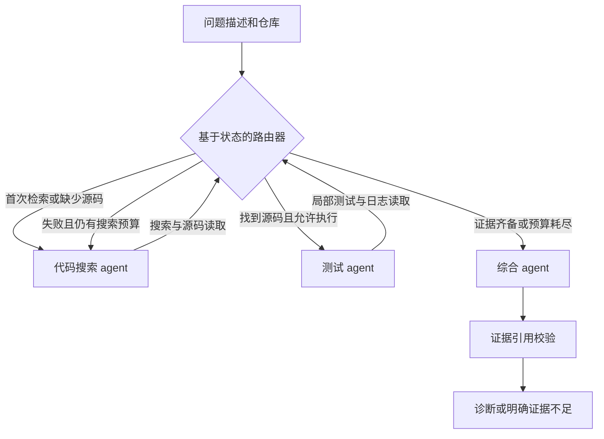

# Agentic Code-Search & Debugging Assistant

[](https://github.com/YeDonS/agentic-code-search/actions/workflows/ci.yml)
[English](README.md) · [简体中文](README.zh-CN.md) · [面试讲解](docs/INTERVIEW.md)

基于 **LangChain、LangGraph、FastAPI 和 Docker** 的开发助手。三个专职 agent
分别定位代码、复现失败、综合诊断，输出附带源码引用和修复建议，不直接修改仓库。

## 实现与验证状态

| 项目 | 状态 |
|---|---|
| 搜索、测试、综合三个 agent 及条件路由 | 已实现，离线集成测试覆盖 |
| 仓库搜索、源码读取、pytest 执行、日志读取 | 真实工具，具有调用预算和事件日志 |
| FastAPI、Bearer 认证、交互式接口文档 | 本地已验证 |
| Docker 服务、受限测试镜像、Compose | 由 GitHub Actions 构建并验证 |
| 12 个仓库的 100 条历史问题 | 固定版本 SWE-bench Lite 子集，可重复选样 |
| 100 个修复前快照的检索基线 | **全部完成；Hit@1 40%，Hit@5 71%，MRR@5 0.5202** |
| 真实模型根因正确率 | 接入与人工评分流程已实现；**尚未评测** |
| 生成补丁的回归测试通过率 | 官方评测导出与评分已实现；**尚未评测** |

这些数字衡量“候选文件是否命中维护者补丁修改的文件”，不是修复成功率。
当前环境没有可用模型凭证，未进行真实模型评测。固定演示使用人工构造缺陷，
排除在 100 条历史任务之外。[真实运行结果与日志](reports/README.md)。

## 快速运行

需要 Python 3.11+、[uv](https://docs.astral.sh/uv/getting-started/installation/) 和 Git。
演示不需要模型密钥或 Docker。

```bash
git clone https://github.com/YeDonS/agentic-code-search.git
cd agentic-code-search
uv sync --locked --all-extras
uv run code-assistant demo
```

演示问题是 `calculate_total(100, discount=0)` 错误返回 `90`。系统会搜索源码、
读取函数、真实执行测试得到 **1 failed, 2 passed**，读取失败日志后再次检索，
最后输出带证据编号的根因和统一格式补丁。

`mode=demo` 使用固定脚本模拟 LangChain 模型，**不是 LLM 推理**，只接受内置问题。
另一个回归测试把建议补丁应用到临时副本，确认 **3 passed**。助手自身只运行修复前
测试，因此返回中的 `patch_verified` 仍然为 `false`。

## 路由与工具



监督路由由确定性规则控制，模型选择角色内部的工具调用。三个 agent 有独立提示词、
工具权限和对话上下文，可以共享一个模型，按顺序执行。

| agent | 工具 |
|---|---|
| 代码搜索 | `search_repository`、`read_file` |
| 测试 | `read_file`、`run_tests`、`inspect_logs` |
| 综合 | 无执行工具，输出经校验的 JSON 诊断 |

受影响文件必须出现在真实登记的源码读取引用中。这能验证出处，不能自动证明因果解释
正确。证据不足或模型主动放弃时返回 `insufficient_evidence`。检索轮数、模型轮数、
工具次数、读取范围、测试时长及输出大小均有限制。[架构及限制](docs/ARCHITECTURE.md)。

## 接入真实模型与仓库

```bash
cp .env.example .env
# 在 .env 中配置 ASSISTANT_MODE=model、ASSISTANT_MODEL=provider:model-id，
# 以及对应的 ANTHROPIC_API_KEY 或 OPENAI_API_KEY。
uv run code-assistant debug /你的仓库路径 "描述实际行为、预期行为及复现条件"
```

CLI 的 `debug` 始终使用真实模型。请选择账号可用、支持工具调用的模型；配置示例中的
模型名称可修改。密钥从环境变量或 `.env` 读取，相关源码片段会发送给配置的模型服务。
测试执行默认关闭；仅对可信代码显式添加 `--executor local`，或通过宿主机使用 Docker：

```bash
docker build --target test-runner -t code-assistant-test:local .
uv run code-assistant debug /你的仓库路径 "问题描述" --executor docker
```

通用镜像只有 pytest，不包含任意项目的依赖。需要时自行构建依赖镜像，并配置
`ASSISTANT_TEST_IMAGE`。历史任务的正式补丁评测使用 SWE-bench 官方镜像。

## FastAPI 与 Docker

```bash
# 显式允许执行可信的内置演示测试。
ASSISTANT_TEST_EXECUTOR=local uv run code-assistant serve
curl http://127.0.0.1:8000/v1/debug \
  -H 'Content-Type: application/json' \
  -d '{"repository":"checkout","issue":"Passing discount=0 to calculate_total(100, discount=0) returns 90 instead of 100."}'
```

打开[交互式接口文档](http://127.0.0.1:8000/docs)。其他仓库通过
`ASSISTANT_WORKSPACE_ROOT` 指定父目录，请求传相对目录。向回环地址之外开放前应配置
`ASSISTANT_API_TOKEN`，请求发送 `Authorization: Bearer <token>`。服务限制路径范围，
最多同时执行两个请求，不开放通配 CORS，也不接受任意 shell 命令。

```bash
docker compose up --build
docker compose run --rm assistant code-assistant demo
```

Compose 绑定回环地址，使用非 root 用户、只读文件系统和独立日志卷，API 默认不执行
测试。服务容器不挂载 Docker socket。真实仓库可增加只读挂载，并配置容器内工作区路径。

## 重跑历史基准

```bash
uv run code-assistant benchmark build  # 可选：从固定上游版本重建已提交的任务集
uv run code-assistant benchmark run runs/my-retrieval-100 --mode retrieval
uv run code-assistant logs runs/my-retrieval-100
# 下面需要模型凭证，先运行三条试验再扩大规模。
uv run code-assistant benchmark run runs/model-pilot --mode model --limit 3
uv run code-assistant benchmark run runs/model-100 --mode model
uv run code-assistant benchmark export runs/model-100/predictions.jsonl runs/model-100/swebench.jsonl
```

agent 只获得问题文本和 `base_commit` 对应的修复前源码压缩包，无法读取 Git 历史、
标准补丁、隐藏测试补丁及评分标签。推理结束后再评分，失败样本不会从分母删除。
文件定位、人工根因判定和官方测试通过率分别计算。
[选样、评分、泄漏风险与官方测试步骤](docs/BENCHMARK.md)。

## 日志与项目检查

每次诊断生成 `runs/<id>/events.jsonl` 和 `response.json`。历史评测还记录任务清单、
环境、源码指纹、压缩包哈希、逐条预测、分数和每条 issue 的独立日志。
事件字段包括路由原因、角色、工具、状态、耗时、证据数、测试退出码，以及模型返回的
token 用量。事件日志不记录提示词、源码正文和隐藏推理。包含证据全文的本地结果
由 Git 忽略，不自动公开。

`code-assistant logs <目录>` 汇总空检索、工具和环境错误、超时、索引截断、无效综合输出
及未完成运行。[面试讲解](docs/INTERVIEW.md)。

```bash
uv run ruff check src tests
uv run ruff format --check src tests
uv run pytest --cov=code_assistant
uv build
```

CI 覆盖 Python 3.11/3.12/3.13，并验证两种 Docker 镜像。故意失败的演示测试由子进程
执行，不会被项目测试套件直接收集。

`src/code_assistant/` 为实现，`examples/` 为演示，`benchmarks/` 为任务及独立标签，
`tests/` 为行为测试，`docs/` 为设计与面试说明，`reports/` 为可公开的运行证据。
项目代码采用 [MIT](LICENSE)；历史数据与源码归上游作者所有。[来源说明](benchmarks/NOTICE.md)。
