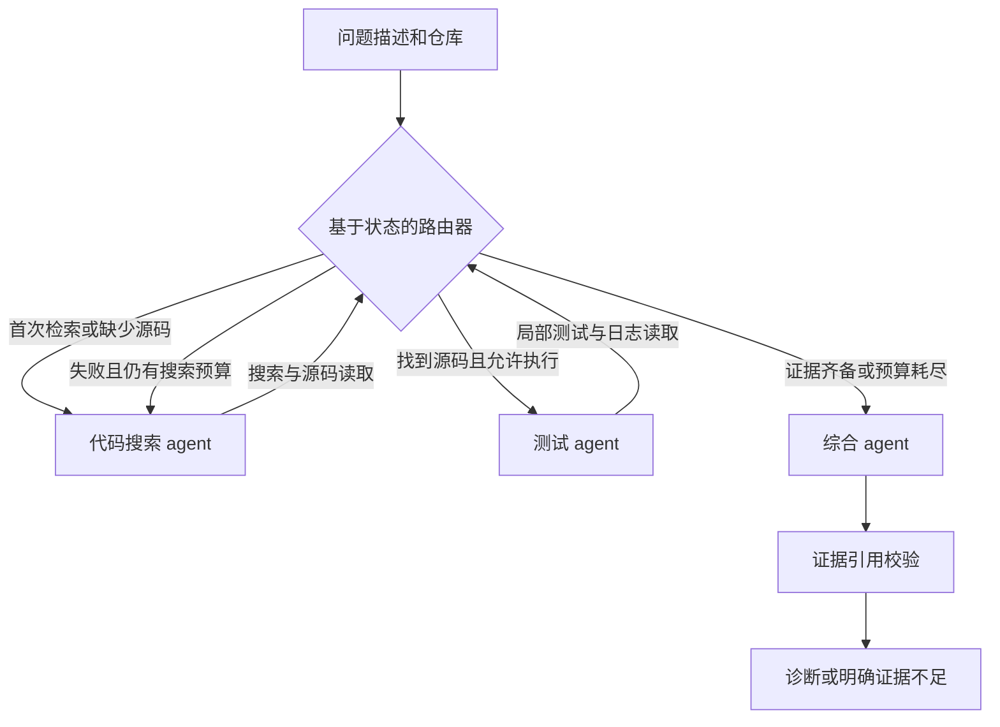

# Agentic Code-Search & Debugging Assistant

[](https://github.com/YeDonS/agentic-code-search/actions/workflows/ci.yml)
[English](README.md) · [简体中文](README.zh-CN.md)

基于 **LangChain、LangGraph、FastAPI 和 Docker** 的开发助手。历史成绩来自
**代码搜索 → 综合诊断** 两步流程，输出带源码引用的诊断与补丁，不直接修改仓库。
对显式允许执行的可信仓库，还提供测试 agent 及“测试失败后回到搜索”的路由。

**原始 48/100 没有测试 agent 参与推理。** 100 条 trace 全部是搜索 → 综合，官方
容器测试在补丁冻结后单独执行。小型 checkout 示例只能验证流程连通，不能证明真实
项目上的多 agent 优势。

## 实现与验证状态

| 项目 | 状态 |
|---|---|
| 搜索、测试、综合三个 agent 及条件路由 | 已实现，离线集成测试覆盖 |
| 仓库搜索、源码读取、pytest 执行、日志读取 | 真实工具，具有调用预算和事件日志 |
| FastAPI、Bearer 认证、交互式接口文档 | 真实模型 HTTP 验证通过：无令牌 401，有令牌 200 |
| Docker 服务及受限测试镜像 | 两种镜像的 GitHub Actions 构建及运行验证均通过 |
| 12 个仓库的 100 条历史问题 | 固定版本 SWE-bench Lite 子集，可重复选样 |
| 100 个修复前快照的检索基线 | **全部完成；Hit@1 40%，Hit@5 71%，MRR@5 0.5202** |
| 100 条真实模型运行 | **90 条带证据诊断，10 条证据不足；文件 Hit@1 87%，Hit@5 88%** |
| 生成补丁的官方测试 | **48/100 解决**；23 条未通过、27 条空补丁、2 条超时，全部计入分母 |
| 原无效补丁的事后补救 | **17/17 可应用、11/17 官方解决**；有限纠错，独立于原始 48/100 |
| 20 题配对对照 | **单 agent 11/20，两种两步流程均 10/20**；同模型、相同调用上限，[协议与结果](docs/EXPERIMENTS.md) |

单 agent 本次实际调用和报告 token 更少，小样本未支持路由流程的优势。两种证据窗口
均解决同一组 10/20 题。源码优先确实减少源码丢失，但尚未
观察到修复率提升。17 题补救使用了额外推理预算，不是新的首次成功率。

文件定位指标衡量“候选文件是否命中维护者补丁修改的文件”，与修复成功率分别计算。
完整模型运行通过本地 Codex CLI 登录调用 `gpt-6.1-sol`，配置和源码指纹已冻结。
BM25 仅作检索参考，不能充当同条件的 LLM 对照。自动根因评审保留作审计，不列为主成绩：
被判正确的解释有 40 条没有解决，另有 1 条被判错误的补丁实际通过了官方测试。
人工根因准确率仍未测。功能解决率依据官方测试。100 条按仓库均衡抽取，与 Lite 完整
分布不同，**48% 不与其排行榜横比**；公开历史修复也可能已进入模型训练数据。
固定演示排除在历史任务之外。
[真实运行结果与日志](reports/README.md) · [复现模型评测](docs/MODEL_EVALUATION.md)。

## 快速运行

需要 Python 3.11+、[uv](https://docs.astral.sh/uv/getting-started/installation/) 和 Git。
演示不需要模型密钥或 Docker。

```bash
git clone https://github.com/YeDonS/agentic-code-search.git
cd agentic-code-search
uv sync --locked --all-extras
uv run code-assistant demo
```

演示问题是 `calculate_total(100, discount=0)` 错误返回 `90`。系统会搜索源码、
读取函数、真实执行测试得到 **1 failed, 2 passed**，读取失败日志后再次检索，
最后输出带证据编号的根因和统一格式补丁。

`mode=demo` 使用固定脚本模拟 LangChain 模型，**不是 LLM 推理**，只接受内置问题。
另一个回归测试把建议补丁应用到临时副本，确认 **3 passed**。助手自身只运行修复前
测试，因此返回中的 `patch_verified` 仍然为 `false`。

## 路由与工具



监督路由由确定性规则控制，模型选择角色内部的工具调用。三个 agent 有独立提示词、
工具权限和对话上下文，可以共享一个模型，按顺序执行。

| agent | 工具 |
|---|---|
| 代码搜索 | `search_repository`、`read_file` |
| 测试 | `read_file`、`run_tests`、`inspect_logs` |
| 综合 / 有限补丁纠错 | `read_file`；输出经校验的 JSON，无执行工具 |

默认窗口保留最多 24 条不同观察，优先源码读取，其次测试/日志，最后搜索片段；完整
证据账本不丢弃。应用检查失败后最多纠错两次，共享每题 18 次模型、18 次工具调用上限，
保留原始候选及每次尝试。支持文本文件新建/删除，拒绝重命名、二进制和符号链接。
设置 `ASSISTANT_WORKFLOW=single` 可使用单一调查对话；纯单对话对照还需设置
`ASSISTANT_PATCH_REPAIR_ATTEMPTS=0`，禁用后续独立纠错。

已存在的受影响文件必须有登记的源码读取引用；声明新建文件也须引用真实的已有源码。
这能验证出处，不能自动证明因果解释
正确。证据不足或模型主动放弃时返回 `insufficient_evidence`。检索轮数、模型轮数、
工具次数、读取范围、测试时长及输出大小均有限制。[架构及限制](docs/ARCHITECTURE.md)。

## 接入真实模型与仓库

独立推理及部署服务优先使用模型 API Key，经 LangChain 直接调用 OpenAI 或 Anthropic，
选择自己账号可用、支持工具调用的模型：

```bash
cp .env.example .env
# 配置 ASSISTANT_MODE=model、ASSISTANT_MODEL=provider:model-id，
# 以及对应的 ANTHROPIC_API_KEY 或 OPENAI_API_KEY。
uv run code-assistant doctor
uv run code-assistant debug /你的仓库路径 "描述实际行为、预期行为及复现条件"
```

`doctor` 仅检查配置，不代表推理通过。本次环境没有独立模型 API Key，原生 API
适配器做了离线配置测试，尚无真实 API 调用验证。更换模型/提供商属于新实验，不能据此
复现已发布模型的同一成绩。

另提供可选的本地 [Codex CLI 适配器](https://learn.chatgpt.com/docs/non-interactive-mode)。
历史实验使用 CLI 0.162.0-alpha.2 和账号特定的模型别名：

```bash
codex login
export ASSISTANT_MODEL=codex-cli:gpt-6.1-sol  # 选择账号可用的模型
export ASSISTANT_CODEX_REASONING_EFFORT=medium
export ASSISTANT_CODEX_TRANSPORT=https       # 可选；本次网络采用此设置
uv run code-assistant doctor
uv run code-assistant debug /你的仓库路径 "描述实际行为、预期行为及复现条件"
```

这会消耗 Codex 账户额度。适配器在空临时目录运行，关闭内置执行、联网搜索和连接器，
通过结构化 JSON 请求项目工具；仓库只向项目的白名单工具开放。登录凭证由 CLI 自行
管理，不复制到公开 CI 或 Docker 镜像。

CLI 参数和模型可用性可能变化。将订阅登录用于服务前，应核对适用的账户条款和支持范围；
本仓库不作合规或资格承诺。冻结补丁的官方复跑不依赖 CLI 登录或模型别名。

CLI 的 `debug` 始终使用真实模型。请选择账号可用、支持工具调用的模型；配置示例中的
模型名称可修改。密钥从环境变量或 `.env` 读取，相关源码片段会发送给配置的模型服务。
测试执行默认关闭；仅对可信代码显式添加 `--executor local`，或通过宿主机使用 Docker：

```bash
docker build --target test-runner -t code-assistant-test:local .
uv run code-assistant debug /你的仓库路径 "问题描述" --executor docker
```

通用镜像只有 pytest，不包含任意项目的依赖。需要时自行构建依赖镜像，并配置
`ASSISTANT_TEST_IMAGE`。历史任务的正式补丁评测使用 SWE-bench 官方镜像。

## FastAPI 与 Docker

```bash
# 显式允许执行可信的内置演示测试。
ASSISTANT_TEST_EXECUTOR=local uv run code-assistant serve
curl --noproxy 127.0.0.1 http://127.0.0.1:8000/v1/debug \
  -H 'Content-Type: application/json' \
  -d '{"repository":"checkout","issue":"Passing discount=0 to calculate_total(100, discount=0) returns 90 instead of 100."}'
```

使用上面的真实模型配置启动服务时，另设 `ASSISTANT_MODE=model`。
[真实模型 HTTP 验证](reports/real-model-api/validation.json)已通过认证并完成可信示例的
“搜索 → 测试 → 再搜索 → 综合”。

打开[交互式接口文档](http://127.0.0.1:8000/docs)。其他仓库通过
`ASSISTANT_WORKSPACE_ROOT` 指定父目录，请求传相对目录。向回环地址之外开放前应配置
`ASSISTANT_API_TOKEN`，请求发送 `Authorization: Bearer <token>`。服务限制路径范围，
最多同时执行两个请求，不开放通配 CORS，也不接受任意 shell 命令。

```bash
docker compose up --build
docker compose run --rm assistant code-assistant demo
```

Compose 绑定回环地址，使用非 root 用户、只读文件系统和独立日志卷，API 默认不执行
测试。服务容器不挂载 Docker socket。真实仓库可增加只读挂载，并配置容器内工作区路径。

## 重跑历史基准

```bash
uv run code-assistant benchmark build  # 可选：从固定上游版本重建已提交的任务集
uv run code-assistant benchmark run runs/my-retrieval-100 --mode retrieval
uv run code-assistant logs runs/my-retrieval-100
# 下面需要模型凭证，先运行三条试验再扩大规模。
uv run code-assistant benchmark run runs/model-pilot --mode model --limit 3
uv run code-assistant benchmark run runs/model-100 --mode model --workers 6
# 只允许以完全相同的源码、环境、模型和任务配置续跑。
uv run code-assistant benchmark run runs/model-100 --mode model --workers 6 --resume
uv run code-assistant benchmark export runs/model-100/predictions.jsonl runs/model-100/swebench.jsonl
```

agent 只获得问题文本和 `base_commit` 对应的修复前源码压缩包，无法读取 Git 历史、
标准补丁、隐藏测试补丁及评分标签。推理结束后再评分，失败样本不会从分母删除。
文件定位、人工根因判定和官方测试通过率分别计算。
[选样、评分、泄漏风险与官方测试步骤](docs/BENCHMARK.md)。

## 日志与项目检查

每次诊断生成 `runs/<id>/events.jsonl` 和 `response.json`。历史评测还记录任务清单、
环境、源码指纹、压缩包哈希、逐条预测、分数和每条 issue 的独立日志。
事件字段包括路由原因、角色、工具、状态、耗时、证据数、测试退出码，以及模型返回的
token 用量。事件日志不记录提示词、源码正文和隐藏推理。包含证据全文的本地结果
由 Git 忽略，不自动公开。

`code-assistant logs <目录>` 汇总空检索、工具和环境错误、超时、索引截断、无效综合输出
及未完成运行。[真实日志审计](reports/model-100/log-audit.json)。

```bash
uv run ruff check src tests scripts
uv run ruff format --check src tests scripts
uv run pytest --cov=code_assistant
uv build
```

CI 覆盖 Python 3.11/3.12/3.13，并验证两种 Docker 镜像。故意失败的演示测试由子进程
执行，不会被项目测试套件直接收集。

`src/code_assistant/` 为实现，`examples/` 为演示，`benchmarks/` 为任务及独立标签，
`tests/` 为行为测试，`docs/` 为架构与复现说明，`reports/` 为可公开的运行证据。
项目代码采用 [MIT](LICENSE)；历史数据与源码归上游作者所有。[来源说明](benchmarks/NOTICE.md)。
